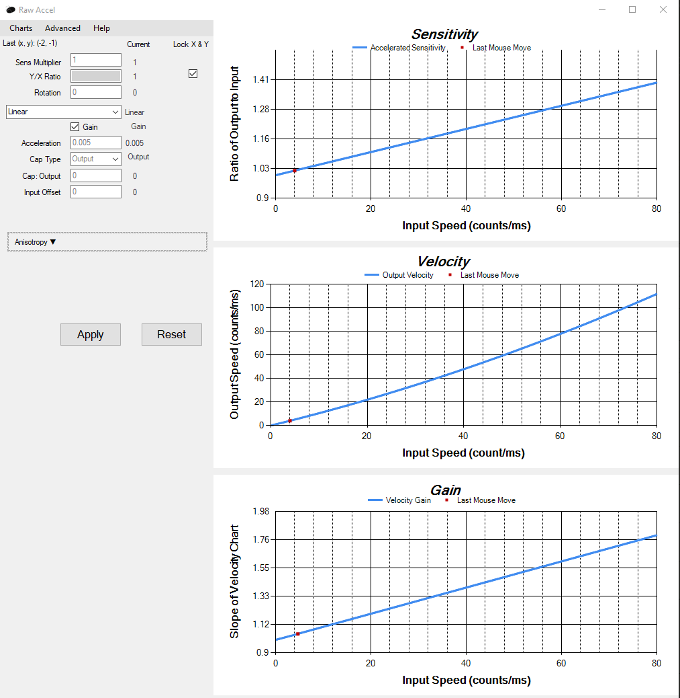
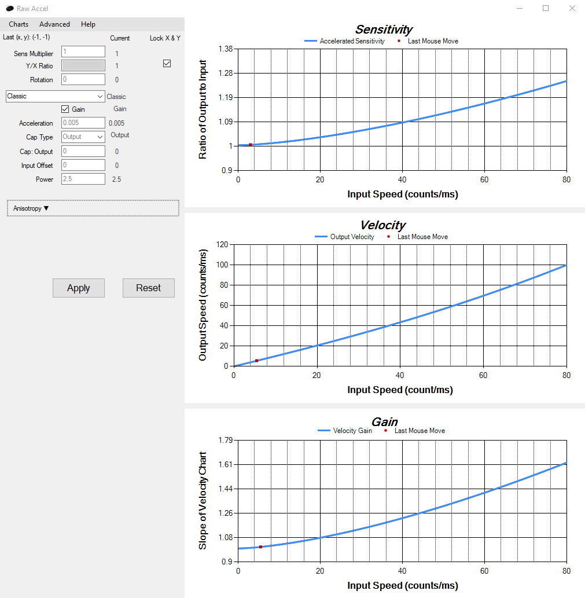
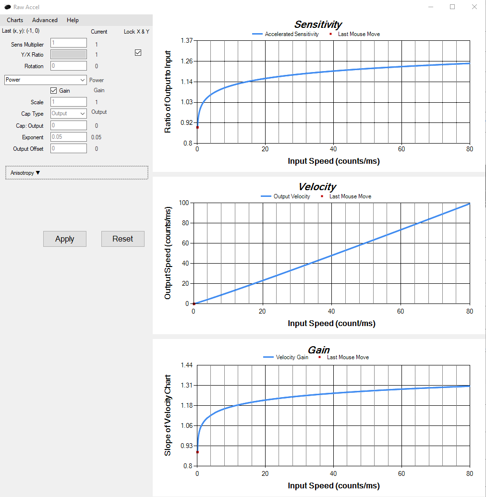
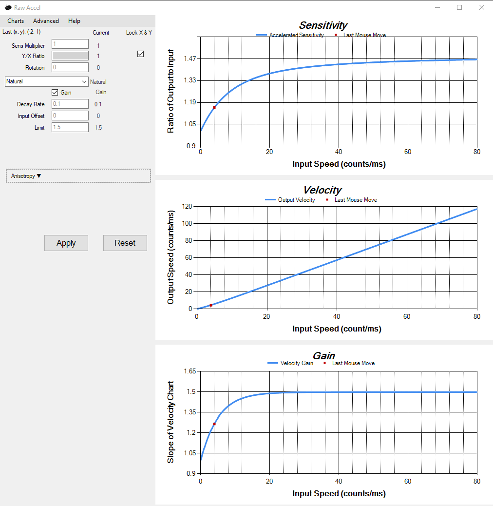
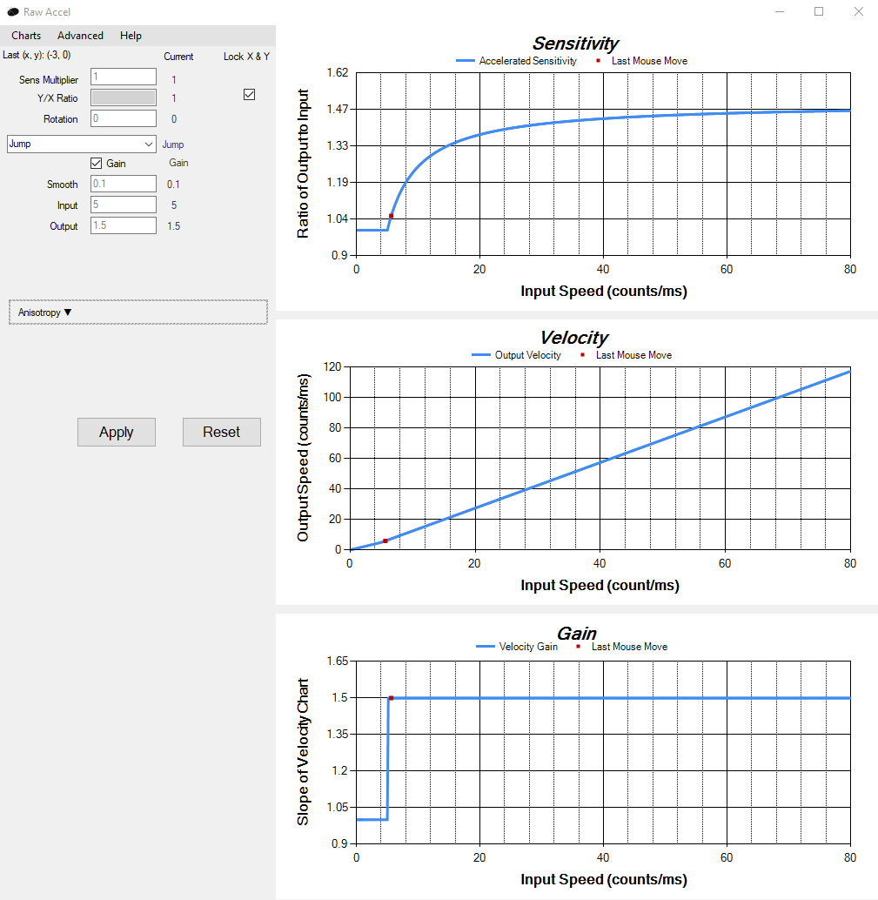
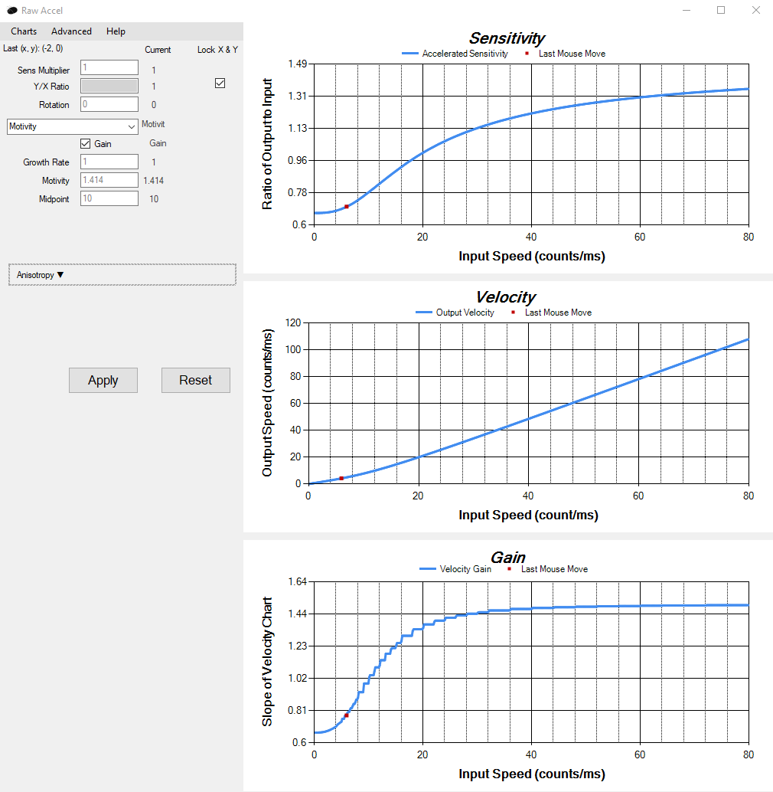
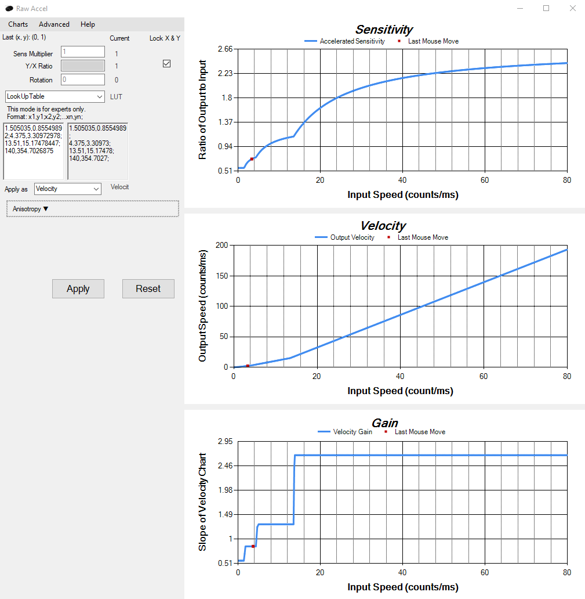

# Raw Accel Guide
## Download

Visit the [Releases page](https://github.com/a1xd/rawaccel/releases) and navigate to the "Assets" dropdown under the latest release, then download the zip file titled `RawAccel_X.X.X.zip` where X are the latest version numbers. **DO NOT** download by clicking the green "Code"/"Download" file on the home page of this repository as that will only download the source code, which isn't what you want.

## Installation
- **Prerequisites**
  * Visual C++ 2019 runtime, [download here](https://aka.ms/vs/16/release/vc_redist.x64.exe)
  * .NET Framework 4.7.2+ runtime, [download here](https://dotnet.microsoft.com/download/dotnet-framework/net48)
  * **For Windows 7 users only** — SHA-2 code signing support (download through Windows Update)

- Run `installer.exe` in the release directory to install the Raw Accel driver. Restart your computer for the installation to take effect.

- Run `uninstaller.exe` in the release directory to uninstall the driver. Restart for the uninstallation to take effect.

- Run `rawaccel.exe` when the driver is installed in order to run the Raw Accel GUI.

## Philosophy
The Raw Accel driver and GUI's workings and exposed parameters are based on our understanding of mouse acceleration. Our understanding includes the concepts of "gain", "whole vs by component", and "anisotropy." For clarity, we will outline this understanding here. Those uninterested can skip to Features below.

### Measurements from Input Speed
Raw Accel, like any mouse modification program, works by acting on a passed-in (x,y) input in order to pass back out an (x,y) output. The GUI program creates charts by feeding a set of (x,y) inputs and times to the driver code to receive a set of (x,y) outputs. The following measurements, available as charts in Raw Accel, are then found from the outputs:

- **Sensitivity**: The ratio of the output speed to the input speed. The "sensitivity multiplier" parameter in the program is a multiplier used on the post-calculation output vector.
- **(Output) Velocity**: The speed of the final output vector. The output vs input velocity curve is perhaps the most important relationship in a particular setup because it directly describes the output for any given input. (We use "speed" and "velocity" interchangeably, and are aware of the difference elsewhere.)
- **Gain**: The slope of the output vs input velocity curve. It answers the question: "if I move my hand a little faster, how much faster will my cursor move?" The relationship between gain and sensitivity is that if gain is continuous, so is sensitivity. The reverse is not necessarily true, so keeping the gain "nice" ensures "nice" sensitivity but not vice versa.
- For the mathematically inclined: for input speed "v" and Output Velocity f(v), Sensitivity is f(v)/v and Gain is f'(v) = d/dv(f(v)).

Acceleration, then, is a characteristic of the velocity curve, defined as true when the velocity curve is non-linear for any input speed.

### Example
The above is much more clear with an example. Let's say I have 
- linear acceleration with acceleration parameter of 0.01
- a sensitivity parameter of 0.5

and I move my mouse to create an input of (30,40) at a poll rate of 1000 hz.

Then our input speed is sqrt(30^2 + 40^2) = 50 counts/ms. Our accelerated sensitivity is calculated to be (1 + 0.01 \* 50) * 0.5 = 1.5 \* 0.5 = 0.75. So our output velocity is 0.75 \* 50  = 37.5. If I run the previous calculations with input speed 49.9 I get output velocity 37.40005, so our gain is about (37.5-37.40005)/(50-49.9) = 0.9995. Here is a picture of the charts in Raw Accel showing the same thing:

### Horizontal and Vertical
Due to the mechanics of holding a mouse on a desk, users generally move their mouses horizontally (left and right) differently than they move them vertically (forward and back), with more freedom for the wrist and\or arm to move the mouse horizontally than vertically. A user may then desire for various aspects of their output to change based on the direction of their input. For settings which allow this we have co-opted the term "anisotropy", which is "the property of a material which allows it to change or assume different properties in different directions."

In the above "example" section, the x and y inputs are not treated separately; rather they are "combined" by using the magnitude if the input vector: *sqrt(30^2 + 40^2) = 50 counts/ms*. This is called "Whole" application because the whole speed of the input is used and the result is applied to the whole vector. Application styles include:

#### ***Whole***
In this case, the magnitude of the input vector is input to sensitivity calculation, and applied to whole vector, as in example above.
    - (out_x, out_y) = (in_x\*sens_x, in_y\*sens_y) \* f(sqrt(in_x^2 + in_y^2)), where f(v) is our sensitivity function

Separate horizontal and vertical sensitivites still feel great in this mode. (For the mathematically inclined, that's because differing horizontal and vertical sensitivities create a vector field without curl or other oddities.)

There are anisotropic settings for whole mode.  
- **Range**. This scales the range of the sensitivity curve around 1 for the horizontal or vertical direction.  
    - If a given curve varies from 1 to 2 sensitivity, then a range_y of 0.5 would mean that vertical movements vary from 1 to 1.5 sensitivity instead.  
- **Domain**. This scales the domain of curve around 0 for the horizontal or vertical direction.  
    - If a given curve has an offset at 5 count/ms and a cap that is hit at 15 counts/ms, then a domain_y of 2 would mean that vertical movements hit the offset at 2.5 counts/ms and the cap at 7.5 counts/ms instead.  
- **Lp Norm**. The distance calculation can be generalized to ((in_x)^p + (in_y)^p)^(1/p)), bringing the calculation into [Lp space](https://en.wikipedia.org/wiki/Lp_space).  
    - p = 2 is then the "real world" value, yielding the pythagorean theorem as the distance calculation.  
    - Increasing p makes distances for diagonal movements (where in_x and in_y are close) smaller, and increases the dominance of the larger of the two in determining the distance.  
    - As p gets large, the above calculation approaches max(inx, iny). Raw Accel uses this formula when given any p > 64.
    - We recommend almost everyone leave this at 2.  

With all anisotropic settings considered, the full formula looks like:  
- (out_x, out_y) = (in_x\*sens_x, in_y\*sens_y) \* ((f(((domain_x\*in_x)^p + (domain_y\*in_y)^p)^(1/p)) - 1) \* ((2 / Pi) \* arctan(abs(in_y/in_x)) \* (range_y - range_x) + range_x) + 1, where f(v) is our sensitivity function

This can be more easily understood as  
- (out_x, out_y) = (in_x\*sens_x, in_y\*sens_y) \* ((f( domain-weighted lp-space speed) - 1) \* (directional weight) + 1), where f(v) is our sensitivity function

This formula gaurantees the smooth transition from the horizontal to vertical curve and vice versa as the user moves their hand diagonally.

#### ***By Component***  
In this case, the horizontal components are separated and each is given as input to the sensitivity calculation to multiplied by itself before being recombined at output.
    - (out_x, out_y) = (in_x \* f(in_x) \* sens_x, in_y \* f(in_y) \* sens_y))
    - You can also do: (out_x, out_y) = (in_x \* f(in_x) \* sens_x, in_y \* g(in_y) \* sens_y)) where g(v) is some other sensitivity function.

All anisotropic effects for By Component mode can be achieved by setting different x and y curves.  

The authors of this program feel that Whole is the best style for most users, but that users who play games which have very separate horizontal and vertical actions to manage (such as tracking an enemy and controlling recoil) might benefit from trying By Component. By Component may seem more flexible, but it is precisely the restrictions imposed by Whole (no curl) that make it smoother.
  
  
## Features

### Gain Switch
The acceleration curve styles below (see "Acceleration Styles") each describe a certain shape mathematically. The gain switch determines whether that shape is applied in the sensitivity graph or the gain graph. For styles Linear, Classic, and Power, this setting does not change the possible shapes of the velocity curve - that is, for any particular settings with the gain switch set to Sensitivity, there is a different set of settings that will replicate the exact same velocity curve (output for a given hand motion) with the switch set to Gain. For styles Natural, Jump, and Motivity, this is not true, and the gain switch allows new velocity curves for each style. 

### Offsets
An offset, sometimes called a threshold, is a speed in counts before acceleration "kicks in". The legacy way of applying an offset is having a multiplier of 1 below and at the offset, and applying the sensitivity of (speed-offset) above. This legacy "sensitivity offset" is still available but causes a large discontuinity in gain at the point of offset, leading to non-smooth feeling at offset cross. The new default "gain offset" does a little extra math to simply shift the gain graph by the offset amount without any discontinuity. This feels smoother and has almost no effect on sensitivity. The theory behind "gain offsets" is developed in [this document](https://docs.google.com/document/d/1P6LygpeEazyHfjVmaEygCsyBjwwW2A-eMBl81ZfxXZk).

### Caps
A cap is a point after which acceleration is not applied. The legacy way of applying an offset is simply applying the minimum of the cap sensitivity and the calculated sensitivity for any acceleration calculation. Thus, for the legacy "sensitivity cap" the value given is a sensitivity. This cap style is still available but causes a large discontinuity at the point of offset, leading to a non-smooth feeling at cap cross. The new default "gain cap" effectively caps the gain, but for internal calculation reasons, does so for a given speed rather than a given gain value. This feels much smoother but might have a large effect on sensitivity as gain generally raises faster than sensitivity. We recommend that users use a gain cap and simply adjust it to hit at the gain equivalent to the sensitivity they'd like to cap at. The theory behind "gain caps" is developed in [this document](https://docs.google.com/document/d/1FCpkqRxUaCP7J258SupbxNxvdPfljb16AKMs56yDucA).

### Weight
Our acceleration functions generally have sensitivity functions that start at 1 and then increase. A weight is a multiplier of that increase before it is added to 1. For instance, if we would have had accelerated sensitivity 1.5, weight of 0.5 will result in accelerated sensitivity 1.25 (1 + 0.5\*0.5), and a weight of 3 would have resulted in a sensitivity of 2.5 (1 + 0.5\*3).

Weight is primarily a quick and dirty way to test a new curve. It also can be given a negative value to allow negative acceleration. Most acceleration styles could just change the parameters to have the same affect as setting a weight. Some curves, like the logarithm style, can achieve a greater range of shapes by changing weight.

### Anisotropy
See "Horizontal and Vertical" in the philosophy section to understand what these options do.

### Last Mouse Move
The Raw Accel GUI reads the output of the raw input stream, and thus the output of the Raw Accel Driver, and displays on the graphs red points corresponding to the last mouse movements. These calulations should be fast and your graph responsive, but it comes at the cost of higher CPU usage due to needing to refresh the graph often. This feature can be turned off in the "Charts" menu.

### Scale by DPI and Poll Rate
This option does not scale your acceleration curve in any way. Rather, DPI scales the set of points used to graph your curve, and shows you a window of input speed relevant for your chosen DPI. The poll rate is used as a safeguard for the Last Mouse Move points and therefore should be set for accuracy in that measurement.

## Acceleration Styles
The examples of various types below show some typical settings, without a cap or offset, for a mouse at 1600 DPI and 1000 hz.

### Linear
This is simplest style used by most; it is simply a line rising at a given rate. This is a good choice for new users.

### Classic
This is the style found in Quake 3, Quake Live, and countless inspired followers, including the InterAccel program. It mulplies the speed by a given rate and then raises the product to a given exponent. Any particular linear style curve can be replicated in classic style with an exponent of 2.

### Power
This is the style found in CS:GO and Source Engine games (m_customaccel 3). The user can set a rate by which the speed is multiplied, and then an exponent to which the product is raised, which is then the final multiplier (no adding to 1). In the aforementioned games the default m_customaccel_exponent value of 1.05 would be a value of 0.05 in Raw Accel, leading to a concave slowly rising curve. CS:GO and Source Engine games apply acceleration in an fps-dependent manner, so Raw Accel can only simulate acceleration from these games at a given fps. To do so, set scale to 1000/(in-game fps).

### Natural & NaturalGain
Natural features a concave curve which starts at 1 and approaches some maximum sensitivity. The sensitivity version of this curve can be found in the game Diabotical. This style is unique and useful but causes an ugly dip in the gain graph. The gain version of this curve recreates the Natural style shape in the gain graph without any dips and therefore we recommend this version. Natural is an excellent choice for new users due to only needing a two intuitive parameters which achieve what many users are looking for.

### Jump
 This style applies one sensitivity below a certain threshold, and another above it. It can be useful for those who want one constant sensitivity and gain for slow hand motions and a different constant sensitivity or gain for fast hand motions. Users can set a "smooth" parameter which dictates whether the jump happens instaneously (at smooth 0) or with a slight tailing in and out (smooth 1) leading to a small sigmoid shape (s-shape). (Note that this "smooth" parameter has nothing to do with averaging over mouse counts like in sensor smoothing on mice or mouse smoothing in games.)

### Motivity
This curve looks like an "S" with the top half bigger than the bottom. Mathematically it's a "Sigmoid function on a log-log plot". A user can set the "midpoint" of the S, the "growth rate" (i.e. slantedness) of the S, and the "motivity". "Motivity" sets min and max sensitivity, where the maximum is just "motivity", and the minimum is "1/motivity." (Sensitivity or gain is 1 at the midpoint.) The gain version of this curve is calculated and stored in a lookup table before applying acceleration, which makes the gain graph look a little funny.  This is an excellent choice for power users and new users who don't mind playing with the settings a little.

### Look Up Table
This curve style is a blank canvas on which to create a curve. It allows the user to define the points which will make up the curve. For this reason, this mode is only for experts who know exactly what they want. Points can be supplied in the GUI according to format x1,y1;x2,y2;...xn.yn or in the settings.json in json format. The default Windows mouse acceleration settings (Enhanced Pointer Precision) can be very closely emulated with this style, using points: "1.505035,0.85549892;4.375,3.30972978;13.51,15.17478447;140,354.7026875;".

## Further Help
Further help and frequently asked questions can be found in the [FAQ](https://github.com/a1xd/rawaccel/blob/master/doc/FAQ.md).
